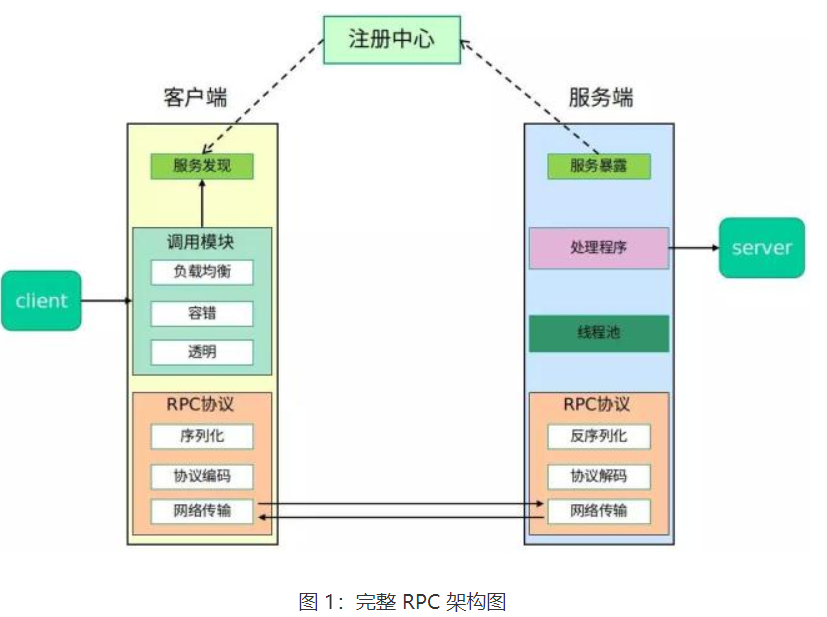

# RPC - Remote Procedure Calls
## 1. 什么是RPC
- RPC（Remote Procedure Call）远程过程调用，是一种通过网络从远程计算机程序上请求服务，而不需要了解底层网络技术的协议。
- RPC是一种协议，用于实现客户端和服务器之间的通信。客户端调用远程服务器上的过程，就像调用本地过程一样。
- RPC的目的是隐藏网络通信的复杂性，使得远程过程调用就像本地调用一样简单。
- RPC的实现方式有很多，比如：gRPC、Thrift、Dubbo、Hessian、WebService等。
## 2. RPC的架构

- 客户端：客户端是调用远程服务的应用程序。
- 服务端：服务端是提供服务的应用程序。
- 服务注册中心：服务注册中心是服务的注册与发现中心，用于服务的注册与发现。
- 通信：客户端和服务端之间的通信是通过网络进行的。
- 序列化：客户端和服务端之间的数据传输是通过序列化和反序列化进行的。
## 3. RPC的实现